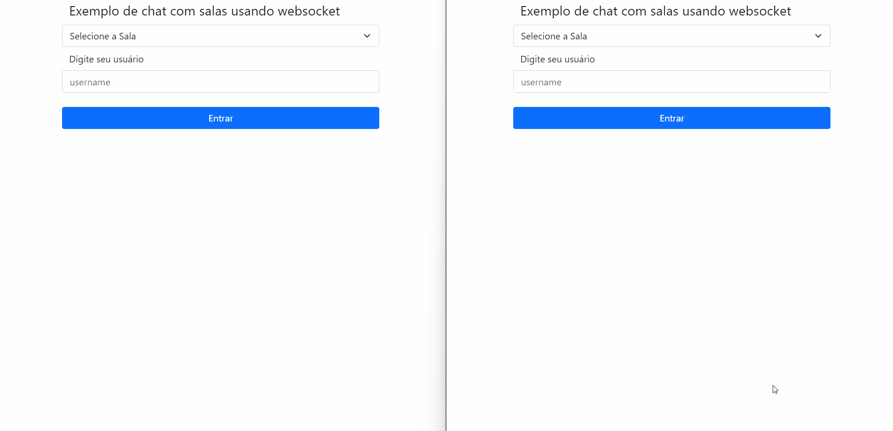

# CHAT COM SALAS USANDO WEBSOCKET 

Exemplo de chat com salas usando websocket - [Implementando WebSockets no Node.Js - Code/drops #99](https://www.youtube.com/watch?v=xEpE7DSOvVw).

# Passos iniciais usados na criação do projeto

- Criar `package.json`

  `npm init -y`
- Instalar o pacote Typescript
  `yarn add typescript -D`
- Instalar o ts-node-dev
  `yarn add ts-node-dev -D`
- Criar arquivo tsconfig.json
- Instalar express e socket.io e os seus tipos (apenas em desenvolvimento):
  ```
  yarn add express socket.io
  yarn add @types/express @types/socket.io -D
  ```

# Como executar o projeto

Executar os comandos:

```
yarn install
yarn dev
```

Posteriormente acessar http://localhost:3000/ em dois _clients_ diferentes para testar.



# Referências

- [Implementando WebSockets no Node.Js - Code/drops #99](https://www.youtube.com/watch?v=xEpE7DSOvVw)
- [WebSocket com Socket.io, NodeJS, Express e TypeScript](https://www.youtube.com/watch?v=EdfVbPWd-dY)
- [Configurando e iniciando projeto Node.js com Typescript](https://medium.com/devmuch/configurando-e-iniciando-projeto-node-js-com-typescript-ae72199c1103)
- [TypeScript With ts-node-dev](https://github.com/abnerfs/ts-node-init)
- [Como configurar um projeto de nó com o Typescript](https://www.digitalocean.com/community/tutorials/setting-up-a-node-project-with-typescript-pt)