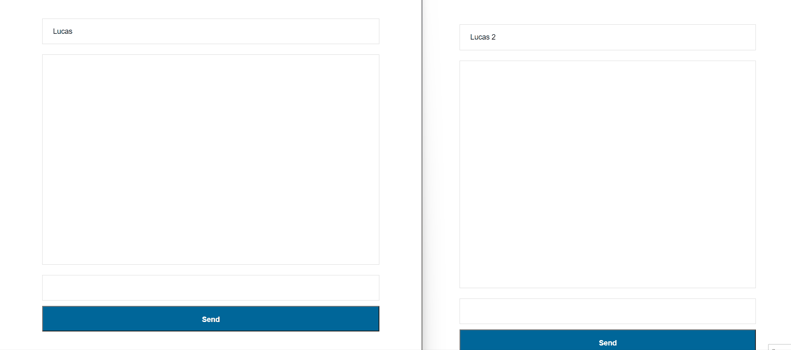

# CHAT SIMPLES COM WEBSOCKET

Chat simples com objetivo de mostrar como o protocolo WSS (WebSockets over SSL/TLS) funciona.

# Bibliotecas utilizadas

- `ejs` -> Template engine do Node padrão.
- `express` -> Framework do Node.
- `socket.io` -> Meio de comunicação entre frontend e backend.

# Como executar o projeto

Executar os comandos:

```
yarn install
node server.js
```

Posteriormente acessar http://localhost:3000/ em dois _clients_ diferentes para testar.



# Referências

- [Chat em tempo real com NodeJS + Socket.io | Diego Fernandes](https://www.youtube.com/watch?v=-jXfKDYJJvo)